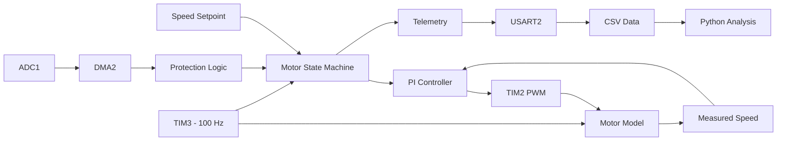
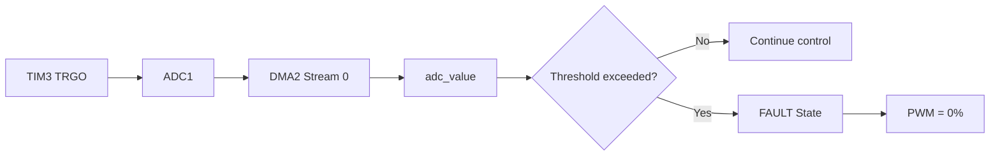
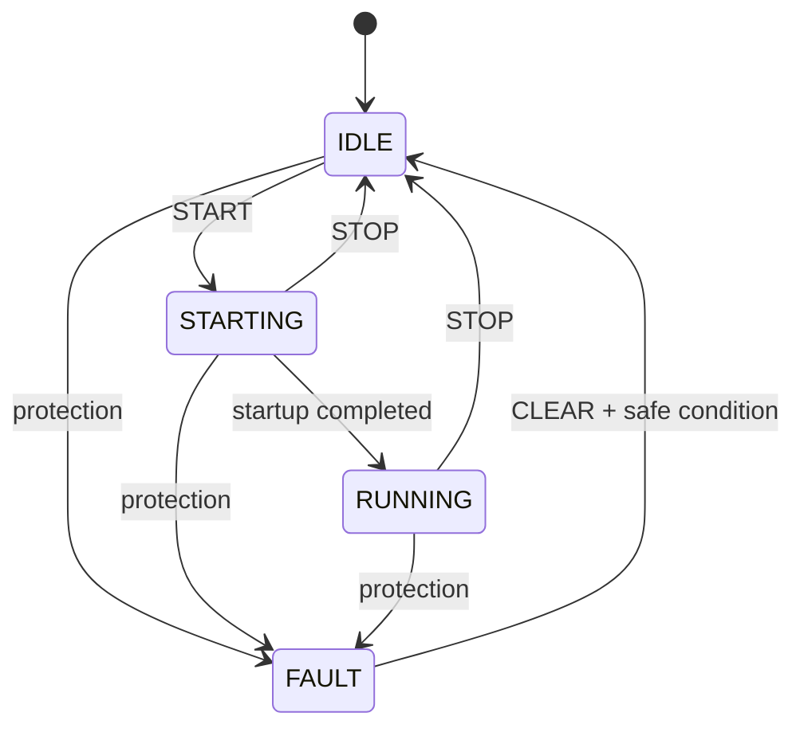
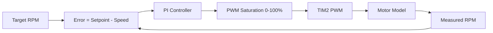
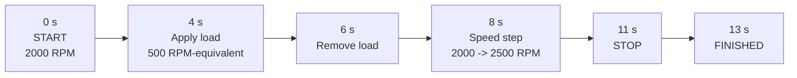
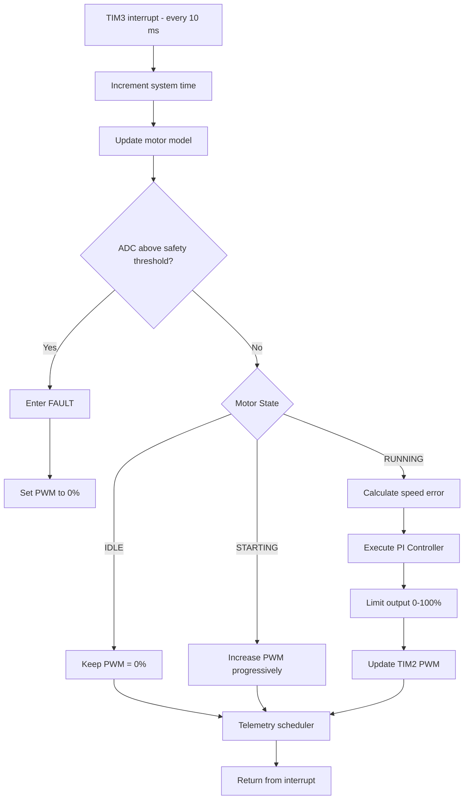
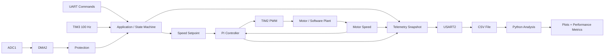

# STM32F407 Real-Time Motor Control

Bare-metal motor-control firmware developed for the **STM32F407**, implementing deterministic timer-based execution, PWM generation, ADC/DMA acquisition, UART telemetry, a motor state machine, closed-loop PI speed control, and automated validation.

The project was developed progressively from low-level STM32 peripherals to a complete closed-loop control system and validated using **Renode** and **Python telemetry analysis**.

---

## Project Overview

The objective of this project was to build and understand a complete real-time motor-control firmware architecture on STM32 without relying on high-level peripheral libraries.

The implementation covers:

- Register-level STM32 programming
- GPIO and RCC configuration
- Timer-based PWM generation
- Deterministic 100 Hz control loop
- ADC acquisition triggered by a hardware timer
- DMA-based data transfer
- UART commands and telemetry
- Motor operating state machine
- Closed-loop PI speed regulation
- Conditional anti-windup
- First-order software motor model
- Automatic validation scenarios
- CSV telemetry export
- Python-based performance analysis
- Renode firmware execution and validation

---

## System Architecture



The architecture separates the application logic, regulation, peripherals, protection and validation path while keeping execution deterministic.

---

# Development Chapters

## Chapter 1 — STM32 Bare-Metal Fundamentals

The project starts with direct access to STM32 peripherals through memory-mapped registers.

Main topics:

- STM32 memory map
- RCC peripheral clocks
- GPIO configuration
- Register manipulation
- Bit masking
- Pointers and `volatile`
- Direct hardware access without HAL

The goal of this chapter was to understand how embedded software directly controls MCU hardware.

---

## Chapter 2 — Timers, PWM and Real-Time Execution

TIM2 is used to generate the PWM signal used as the actuator command.

TIM3 provides the deterministic control-loop timing.

```text
TIM3
100 Hz
  |
  +--> every 10 ms
         |
         +--> update motor model
         +--> execute motor control
         +--> schedule telemetry
```

### PWM configuration

- Timer: **TIM2**
- Channel: **CH1**
- Output pin: **PA5**
- PWM frequency: **1 kHz**

The configured PWM frequency is:

\[
f_{PWM} =
\frac{16\,MHz}
{(15+1)(999+1)}
=
1\,kHz
\]

### Control-loop timing

- Timer: **TIM3**
- Frequency: **100 Hz**
- Period: **10 ms**

This timer is the timing reference for the complete control system.

---

## Chapter 3 — ADC and DMA Acquisition

ADC1 is configured on **PA0 / ADC1_IN0**.

Instead of continuously polling the ADC, the conversion result is transferred automatically to RAM using DMA.



The acquisition path is:

**TIM3 trigger → ADC1 conversion → DMA2 transfer → RAM → protection logic**

This creates deterministic acquisition without CPU polling.

> The ADC/DMA firmware is implemented for the STM32F407 target. The ADC peripheral was not available in the Renode STM32F4 platform used during final emulator validation, so this hardware path was not validated inside Renode.

---

## Chapter 4 — UART Communication and Telemetry

USART2 provides the interface between the firmware and the external environment.

| Function | STM32 Resource |
|---|---|
| UART TX | PA2 / USART2_TX |
| UART RX | PA3 / USART2_RX |
| Baud rate | 115200 |
| Format | 8-N-1 |

Supported commands include:

- `START`
- `STOP`
- `SPEED`
- `LOAD`
- `STATUS`
- `CLEAR`
- `TEST`

Telemetry can be transmitted in two forms:

- Human-readable status
- Machine-readable CSV data for Python analysis

UART transmission is handled outside the control ISR so that communication does not disturb real-time control timing.

---

## Chapter 5 — Motor State Machine and PI Control

### Motor State Machine

The application is organized around four operating states.



### IDLE

- PWM = 0%
- PI controller reset
- Motor waiting for a START request

### STARTING

The duty cycle increases progressively:

```text
0% -> 5% -> 10% -> 15% -> 20% -> 25% -> 30%
```

This provides a controlled open-loop startup before entering closed-loop control.

### RUNNING

The PI controller continuously regulates the motor speed.

### FAULT

- PWM immediately forced to 0%
- Fault state latched
- Recovery only after a valid CLEAR request and safe condition

---

## Closed-Loop Regulation



The control error is:

\[
e[k] = r[k] - y[k]
\]

The PI control law is:

\[
u[k] = K_p e[k] + K_i \sum e[k]
\]

Controller parameters:

\[
K_p = 0.02
\]

\[
K_i = 0.001
\]

The controller output is limited to:

\[
0\% \leq PWM \leq 100\%
\]

A conditional anti-windup mechanism prevents unnecessary integral accumulation while the actuator is saturated.

---

## Chapter 6 — Software Motor Model and Automatic Validation

A first-order software motor model was implemented to validate the controller without requiring a physical motor.

The model follows:

\[
y[k+1]
=
y[k]
+
\frac{target-y[k]}{20}
\]

The target speed is derived from the PWM duty cycle.

A simulated load can be applied as an RPM-equivalent disturbance.

> This model is intended for controller development and firmware validation. It is not a calibrated physical motor model.

### Automatic Test Scenario



The automatic test makes the experiment deterministic and repeatable.

It evaluates:

- Startup
- Regulation at 2000 RPM
- Load disturbance rejection
- Recovery after disturbance removal
- Reference change from 2000 to 2500 RPM
- Controlled stop

---

## Chapter 7 — Renode and Python Validation

The compiled STM32 firmware was executed using **Renode**.

Renode validation covered:

- Cortex-M firmware execution
- TIM2/TIM3 operation
- Periodic interrupt execution
- USART2 telemetry
- Motor state machine
- PI controller
- Software motor model
- Automatic validation sequence

The generated CSV telemetry was then analyzed with Python.

The final experiment produced **130 samples over approximately 13 seconds**.

---

# Control Execution Logic

The main real-time control path runs every 10 ms.



This diagram summarizes the execution order of the firmware control loop.

---

# Peripheral Connections

```text
                    STM32F407
                +-----------------+
                |                 |
 PA5 ---------->| TIM2 CH1        |----> PWM
                |                 |
 PA0 ---------->| ADC1 IN0        |
                |      |          |
                |      v          |
                |    DMA2         |
                |                 |
 PA2 ---------->| USART2 TX       |----> Telemetry
 PA3 <----------| USART2 RX       |<---- Commands
                |                 |
                | TIM3            |
                | 100 Hz          |
                |      |          |
                |      v          |
                | Control ISR     |
                +-----------------+
```

| Peripheral | Purpose |
|---|---|
| TIM2 CH1 | PWM generation |
| TIM3 | 100 Hz deterministic control loop |
| ADC1 | Analog acquisition / protection |
| DMA2 Stream0 | ADC to RAM transfer |
| USART2 | Commands and telemetry |
| NVIC | TIM3 interrupt management |

---

# Complete Data Flow



This represents the complete logical path from user commands and peripheral acquisition to control, telemetry and validation.

---

# Validation Results

## Closed-Loop Speed Response


The test demonstrates:

- Regulation at **2000 RPM**
- Load disturbance at **4 s**
- Load removal at **6 s**
- Reference step from **2000 RPM to 2500 RPM** at **8 s**
- STOP command at **11 s**

### Measured Results

| Test | Result |
|---|---:|
| 2000 RPM rise time | ~0.80 s |
| Initial overshoot | ~0.30% |
| Initial steady-state error | -6 RPM |
| Maximum speed drop under load | ~239 RPM |
| Load recovery to ±2% | ~1.20 s |
| 2500 RPM rise time | ~0.80 s |
| 2500 RPM overshoot | ~0.04% |
| Final error at 2500 RPM | -1 RPM |

---

## PI Controller Output


The PWM duty cycle increases or decreases depending on the speed error.

When the load is applied, the controller increases the PWM command to recover the requested speed.

When the load is removed, the controller reduces the duty cycle accordingly.

---

## Closed-Loop Speed Error


The error converges close to zero under steady-state conditions.

Temporary error increases occur during:

- Startup
- Load application
- Load removal
- Speed-reference changes

---

# Tools

### Embedded Development

- STM32CubeIDE
- GCC
- C
- STM32F407
- Bare-metal register-level programming

### Peripherals

- GPIO
- RCC
- TIM2
- TIM3
- ADC1
- DMA2
- USART2
- NVIC

### Control

- PI controller
- Conditional anti-windup
- State-machine control
- Deterministic periodic execution

### Validation

- Renode
- Python
- Pandas
- Matplotlib
- CSV telemetry

### Development Workflow

- Git
- GitHub

---

# Engineering Decisions

Several design choices were made deliberately:

- Register-level implementation to understand MCU peripherals directly
- Hardware timer instead of software delays
- TIM3 used as the deterministic control time base
- PWM output generated by hardware TIM2
- ADC triggered by TIM3 for deterministic acquisition
- DMA used to transfer ADC samples without CPU polling
- UART communication kept outside the time-critical ISR
- State-machine logic separates operating modes
- PI controller separated conceptually from the simulated plant
- Anti-windup prevents integral accumulation under saturation
- Automated test sequence provides repeatable validation
- CSV telemetry allows quantitative analysis rather than visual inspection only

---

# Validation Scope and Limitations

This project demonstrates the firmware and control architecture of a real-time motor-control system.

The final validation used a **software motor model** rather than a physical motor.

Therefore:

- PI control behavior is validated against the implemented software plant
- Timing, state-machine behavior and telemetry were validated in Renode
- ADC/DMA acquisition is implemented in the target STM32 firmware
- ADC/DMA was not validated in Renode because the selected STM32F4 Renode platform does not provide the required ADC model
- The software motor model is not intended to reproduce the electrical and mechanical behavior of a specific commercial motor

The project should therefore be interpreted as a **firmware and control-system development platform**, not as a calibrated physical motor characterization.

---

# What This Project Demonstrates

This project demonstrates practical experience with:

- Embedded C
- Bare-metal microcontroller programming
- STM32 register-level peripherals
- Real-time execution
- Interrupts
- PWM generation
- ADC/DMA acquisition
- UART communication
- State machines
- Closed-loop control
- PI regulation
- Anti-windup
- Embedded-system validation
- Emulator-based testing
- Python data analysis
- Technical documentation

---

# Technical Report

A complete technical report is available with detailed explanations of the implementation, peripheral configuration, control design, validation methodology and results.
contact me if you need more informations.


---


## Author

**Amine Hamel**

Embedded Systems Engineer  
STM32 • Embedded C • RTOS • MCU • FPGA • Motor Control
